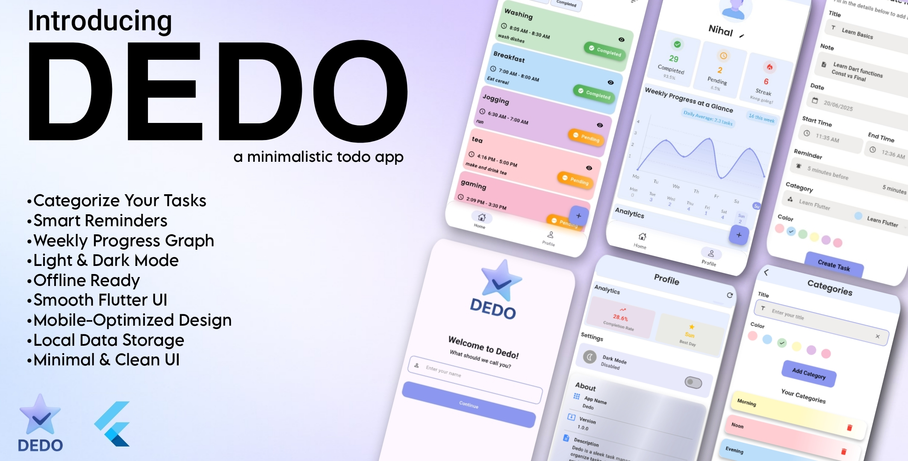
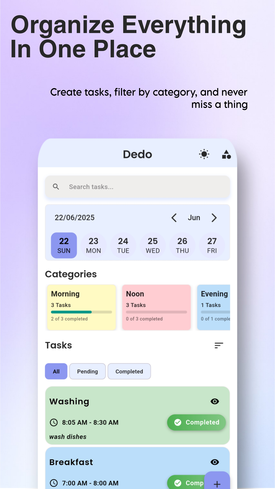
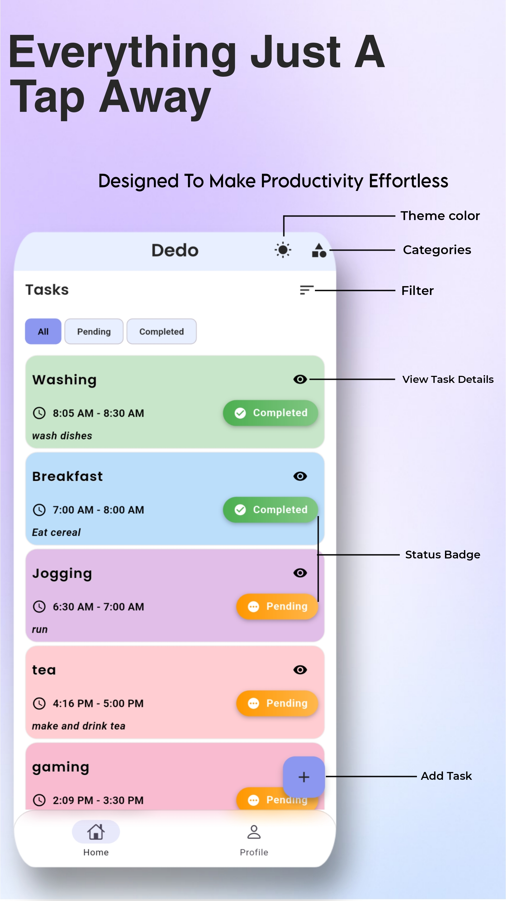
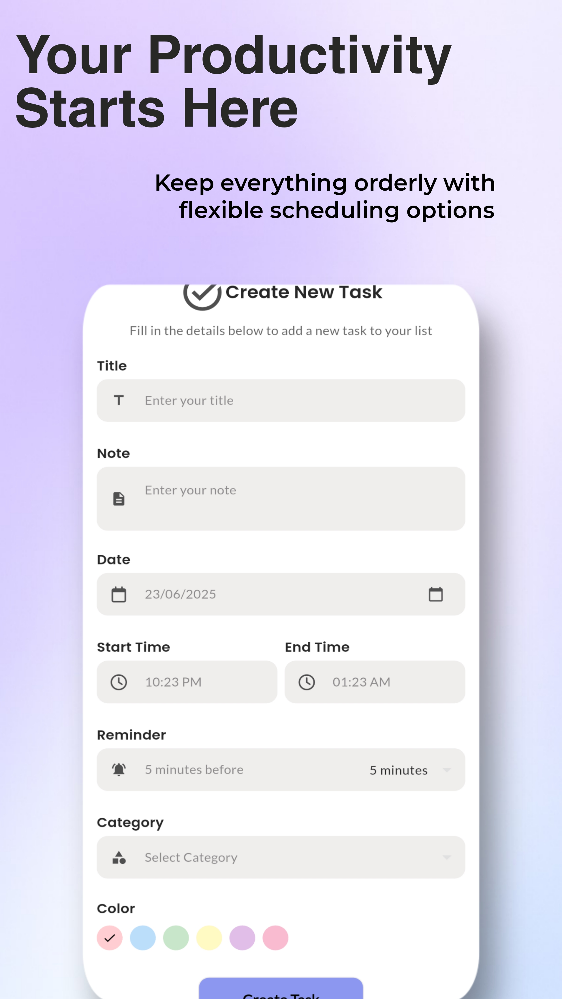
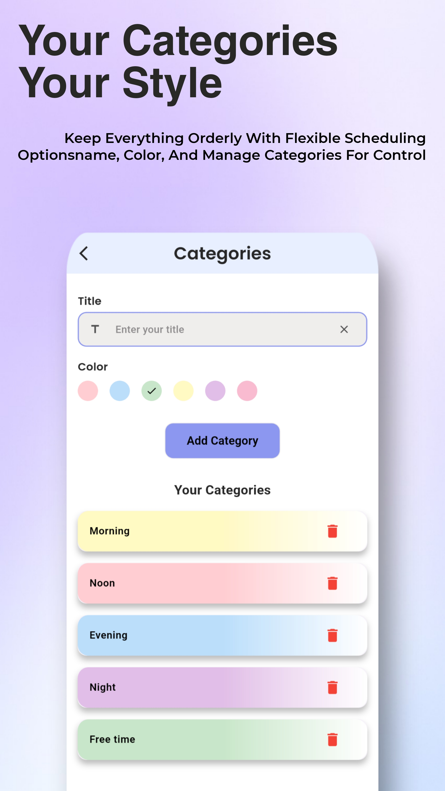
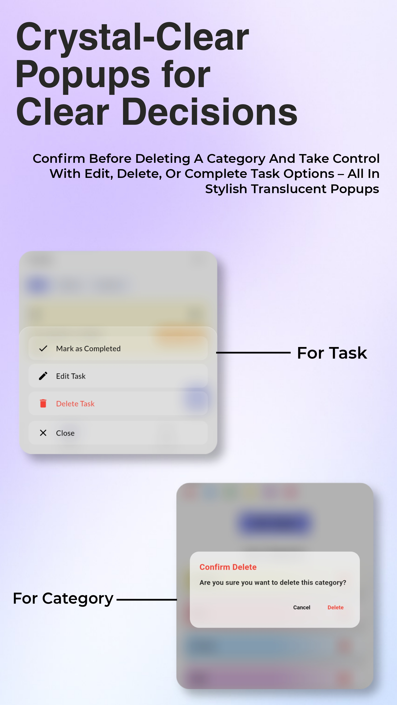
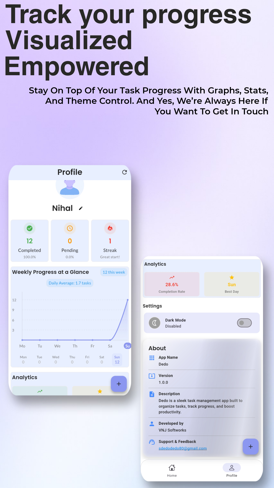
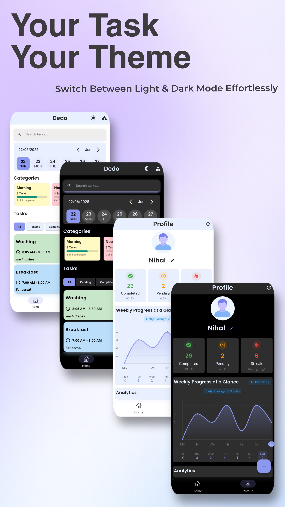
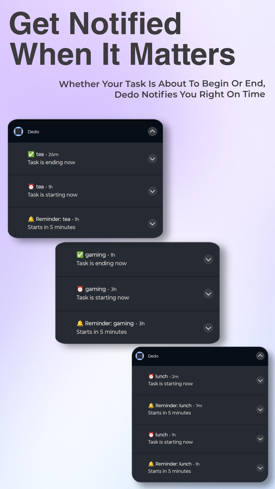

# DEDO - A Flutter To-Do App  

Dedo is a simple and intuitive to-do app built with **Flutter** to help you organize your tasks efficiently.  
It combines **task management, categories, real-time notifications, and activity tracking** in a clean modern UI.  

---

## 🌟 Features  

- Add, edit, and delete tasks. 
- Mark tasks as completed.  
- Categorize tasks for better organization.  
- User-friendly interface with a clean design.  
- Graphs & statistics for activity tracking.  
- Light/Dark theme support.  
- Real-time notifications.  

---

## 📸 Snapshopts  

### 🪪 App Logo  
  

### 📖 Introduction  
  

### ✍️ Enter Name & Start  
  

### 📂 Organize Tasks  
  

### 🔘 Button Alignments & Usage  
  

### ➕ Create a Task  
  

### 🏷️ Add Categories  
  

### 🎨 Transparent UI Design  
  

### 📊 Graphs & Activity Tracking (Real-time)  
  

### 🌙 App Theme & UI  
  

### 🔔 Real-Time Notifications  
  

---

## 📂 Project Setup  

1. Clone the repo:  
   ```bash
   git clone https://github.com/Vivek-k001/DEDO.git
   cd DEDO
2. Installl dependencies:  
   ```bash
   flutter pub get
   flutter pub get

👨‍💻 OWNERS

vivek-k001

Muhammed Jasir M 

Nihal Mohammed V 